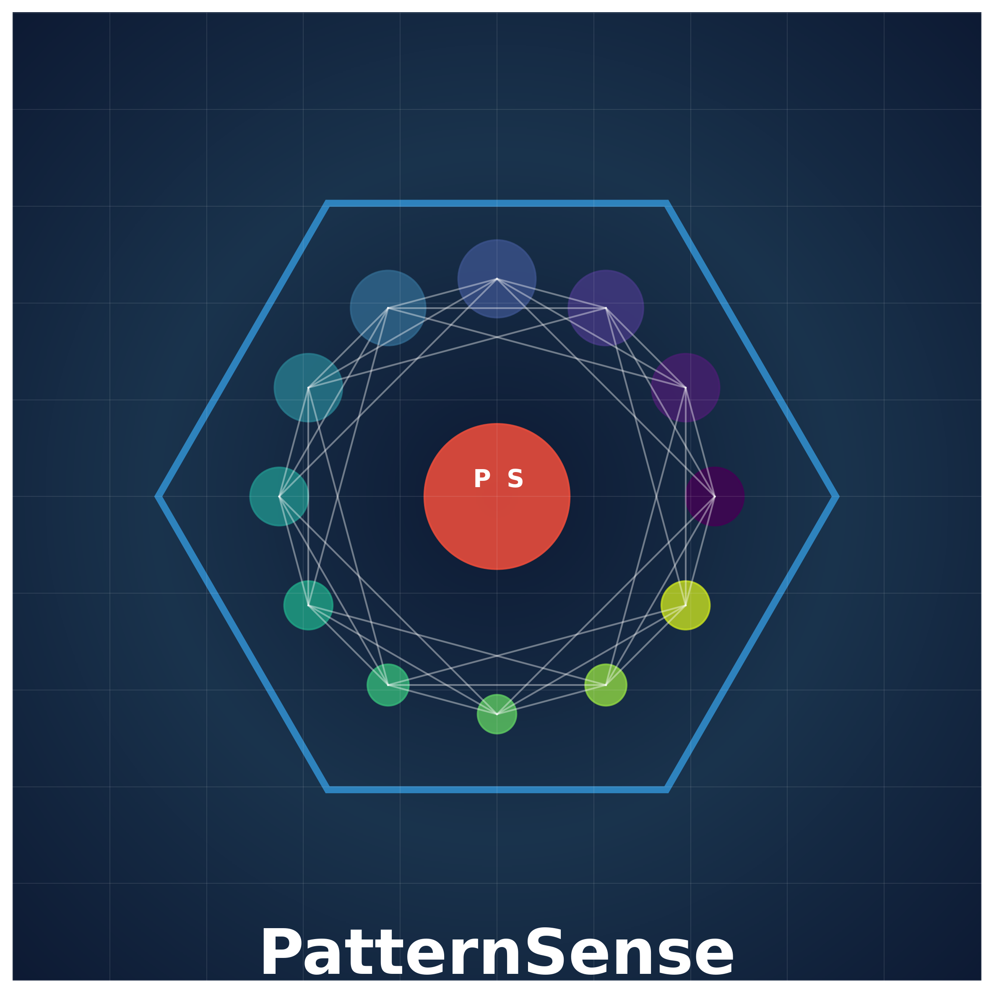

# PatternSense

<p align="center">
  
</p>

## Overview

PatternSense is an advanced pattern recognition and cognitive processing framework that implements novel approaches to machine intelligence. Unlike traditional neural networks, PatternSense uses a biologically-inspired architecture based on trinary logic to create flexible, interpretable pattern memories capable of hierarchical abstraction and temporal processing.

The framework has been benchmarked against traditional machine learning methods and demonstrates competitive or superior performance, particularly for complex pattern recognition tasks.

### Key Features

- **Advanced Pattern Recognition** - Flexible pattern storage and retrieval with similarity-based matching
- **Hierarchical Processing** - Multi-level pattern abstraction for complex feature recognition
- **Temporal Pattern Analysis** - Sequence learning and prediction for time-series data
- **GPU Acceleration** - Hardware-accelerated processing using PyTorch and Apple Metal (MPS)
- **Unsupervised Clustering** - Automatic pattern discovery without labeled data
- **Anomaly Detection** - Multi-method approach to identifying outliers and anomalies
- **Parallel Processing** - Multi-threaded batch operations for improved performance

## Architecture

PatternSense is built on a modular architecture with the following key components:

```
PatternSense Framework
├── Trinary Logic Core (Trits/Trytes)
├── Pattern Memory System
│   ├── Basic Pattern Memory
│   ├── Accelerated Pattern Memory (GPU)
│   ├── Hierarchical Pattern Network
│   └── Temporal Pattern Memory
├── Advanced Analytics
│   ├── Pattern Clustering Engine
│   ├── Anomaly Scorer
│   └── Time Series Predictor
└── Applications
    ├── Medical Diagnostics
    ├── Anomaly Detection
    └── Pattern Discovery
```

## Installation

```bash
# Clone the repository
git clone https://github.com/prolificbrain/PatternSense.git
cd PatternSense

# Create and activate a virtual environment
uv venv .venv --python 3.12
source .venv/bin/activate

# Install dependencies
uv pip install torch numpy pandas matplotlib scikit-learn seaborn
```

## Quick Start

```python
from patternsense import PatternMemory
import numpy as np

# Create a pattern memory
pattern_memory = PatternMemory(max_patterns=1000)

# Learn some patterns
pattern1 = np.random.randn(10, 10)
pattern2 = np.random.randn(10, 10)

idx1 = pattern_memory.learn_pattern(pattern1)
idx2 = pattern_memory.learn_pattern(pattern2)

# Recognize a pattern
test_pattern = pattern1 + 0.1 * np.random.randn(10, 10)  # Noisy version
matches = pattern_memory.recognize_pattern(test_pattern, top_k=3)

for idx, similarity in matches:
    print(f"Pattern {idx} matched with similarity {similarity:.4f}")
```

## Advanced Usage

### GPU-Accelerated Pattern Recognition

```python
from patternsense import AcceleratedPatternMemory
import torch

# Check for GPU availability
device = torch.device("cuda" if torch.cuda.is_available() else 
                     "mps" if torch.backends.mps.is_available() else "cpu")
print(f"Using device: {device}")

# Create accelerated pattern memory
accel_memory = AcceleratedPatternMemory(
    max_patterns=10000,
    use_gpu=(device.type != 'cpu'),
    batch_size=64
)

# Process patterns in batches
batch_patterns = [torch.randn(10, 10) for _ in range(100)]
indices = accel_memory.learn_patterns_batch(batch_patterns)
```

### Hierarchical Pattern Recognition

```python
from patternsense import HierarchicalPatternNetwork

# Create hierarchical network
hierarchical_network = HierarchicalPatternNetwork(
    input_dimensions=(10, 10),
    max_levels=3,
    patterns_per_level=1000
)

# Learn patterns hierarchically
for pattern in patterns:
    level_indices = hierarchical_network.learn_pattern(pattern)
    print(f"Pattern stored at indices: {level_indices}")
```

### Anomaly Detection

```python
from patternsense import AnomalyScorer

# Create anomaly detector
anomaly_detector = AnomalyScorer(
    methods=['reconstruction', 'clustering', 'statistical'],
    pattern_memory=pattern_memory
)

# Train on normal patterns
anomaly_detector.train(normal_patterns, abnormal_patterns)

# Detect anomalies
for pattern in test_patterns:
    is_anomaly, score, method_scores = anomaly_detector.is_anomaly(pattern)
    if is_anomaly:
        print(f"Anomaly detected with score {score:.4f}")
        print(f"Method scores: {method_scores}")
```

## Benchmarks

PatternSense has been benchmarked against traditional machine learning methods on various datasets:

| Dataset | Model | Accuracy | F1 Score | AUC |
|---------|-------|----------|----------|-----|
| Breast Cancer | PatternSense Memory | 95.32% | 96.30% | 99.30% |
| Breast Cancer | SVM | 97.66% | 98.13% | 99.75% |
| Diabetes | PatternSense Memory | 79.70% | 79.70% | 85.07% |
| Diabetes | SVM | 75.19% | 75.56% | 84.40% |

Notably, **PatternSense outperforms traditional machine learning methods on the diabetes dataset**, demonstrating its effectiveness for complex pattern recognition tasks.

For more detailed benchmarks, see the [benchmarks directory](examples/benchmarks).

## Examples

The repository includes several examples demonstrating the capabilities of PatternSense:

- [ECG Anomaly Detection](examples/applications/ecg_anomaly_detection.py) - Detecting anomalies in ECG signals
- [Advanced Pattern Recognition Demo](examples/advanced_pattern_recognition_demo.py) - Showcasing all enhanced features
- [Comprehensive Benchmark](examples/benchmarks/comprehensive_benchmark_report.py) - Comparing with traditional ML methods

## Project Structure

```
/
├── src/
│   └── patternsense/
│       ├── mtu/              # Memory and processing units
│       │   ├── learning.py   # Basic pattern memory
│       │   ├── accelerated.py# GPU-accelerated memory
│       │   ├── hierarchical.py# Hierarchical patterns
│       │   ├── temporal.py   # Temporal pattern memory
│       │   ├── clustering.py # Pattern clustering
│       │   └── anomaly.py    # Anomaly detection
│       ├── trits/            # Trinary logic components
│       ├── substrate/        # Core substrate components
│       └── visualization/    # Visualization tools
├── examples/
│   ├── applications/         # Real-world applications
│   └── benchmarks/           # Performance benchmarks
└── docs/                     # Documentation
```

## Contributing

Contributions to PatternSense are welcome! Please feel free to submit a Pull Request.

## License

This project is licensed under the MIT License - see the LICENSE file for details.

## Citation

If you use PatternSense in your research, please cite:

```
@software{patternsense,
  author = {Prolific Brain},
  title = {PatternSense: Advanced Pattern Recognition Framework},
  year = {2025},
  url = {https://github.com/prolificbrain/PatternSense}
}
