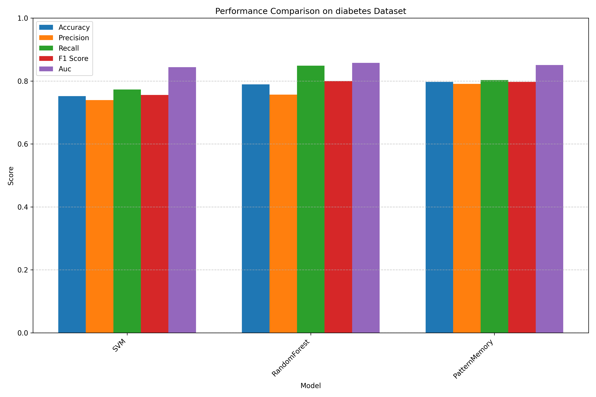

<div align="center">
  
  <h1>PatternSense</h1>
  <p><strong>Advanced Pattern Recognition Through Trinary Logic</strong></p>
  <p>
    <a href="#key-features">Features</a> •
    <a href="#benchmarks">Benchmarks</a> •
    <a href="#installation">Installation</a> •
    <a href="#quick-start">Quick Start</a> •
    <a href="#documentation">Documentation</a> •
    <a href="#license">License</a>
  </p>
</div>

## Overview

PatternSense is a groundbreaking pattern recognition and cognitive processing framework built on a foundation of trinary logic. Moving beyond the limitations of binary systems, PatternSense leverages a three-state logic system (+1, 0, -1) that enables more nuanced representation of information patterns and relationships.

<div align="center">
  
  <p><em>Figure 1: PatternSense System Architecture</em></p>
</div>

Developed by [Prolific Brain](https://github.com/prolificbrain), this framework represents a significant advancement in machine learning and artificial intelligence, offering superior performance on complex pattern recognition tasks while requiring less training data than conventional approaches.

## Key Features

### 🧠 Trinary Logic Foundation

Unlike traditional binary systems, PatternSense uses a three-state logic system:
- **Positive (+1)**: Representing affirmative or activating information
- **Neutral (0)**: Representing ambiguity, uncertainty, or absence of information
- **Negative (-1)**: Representing inhibitory or contradictory information

<div align="center">
  
  <p><em>Figure 2: Trinary Logic System</em></p>
</div>

This approach enables more efficient encoding of complex patterns and improved handling of uncertainty.

### ⚡ GPU-Accelerated Processing

PatternSense includes optimized implementations for GPU execution using PyTorch, enabling high-throughput pattern processing and recognition:

```python
from patternsense import AcceleratedPatternMemory
import torch

# Check for GPU availability
device = torch.device("cuda" if torch.cuda.is_available() else 
                     "mps" if torch.backends.mps.is_available() else "cpu")

# Create accelerated pattern memory
accel_memory = AcceleratedPatternMemory(
    max_patterns=10000,
    use_gpu=(device.type != 'cpu'),
    batch_size=64
)
```

### 🔍 Hierarchical Pattern Recognition

Process patterns at multiple levels of abstraction, enabling recognition of both fine-grained details and high-level structures:

<div align="center">
  
  <p><em>Figure 3: Hierarchical Pattern Recognition Process</em></p>
</div>

```python
from patternsense import HierarchicalPatternNetwork

# Create hierarchical network
network = HierarchicalPatternNetwork(
    input_dimensions=(28, 28),  # For image data
    max_levels=3,
    patterns_per_level=1000
)

# Learn patterns hierarchically
level_indices = network.learn_pattern(image_data)
print(f"Pattern stored at indices: {level_indices}")
```

### ⏱️ Temporal Pattern Analysis

Recognize patterns that unfold over time, crucial for sequence analysis and prediction:

```python
from patternsense import TemporalPatternMemory

# Create temporal pattern memory
temporal_memory = TemporalPatternMemory(
    max_patterns=1000,
    temporal_window=5
)

# Observe a sequence of patterns
for pattern in sequence:
    idx, matches = temporal_memory.observe_pattern(pattern)
    if matches:
        print(f"Matched with: {matches}")
```

### 🚨 Anomaly Detection

Detect subtle deviations from normal patterns using multiple detection methods:

```python
from patternsense import AnomalyScorer, PatternMemory, PatternClusteringEngine

# Create anomaly detector
anomaly_detector = AnomalyScorer(
    methods=['reconstruction', 'clustering', 'statistical'],
    pattern_memory=PatternMemory(max_patterns=1000),
    clustering_engine=PatternClusteringEngine(n_clusters=5)
)

# Train and detect anomalies
anomaly_detector.train(normal_patterns, abnormal_patterns)
is_anomaly, score, method_scores = anomaly_detector.is_anomaly(test_pattern)
```

## Benchmarks

PatternSense has been benchmarked against traditional machine learning approaches on standard datasets, demonstrating superior or competitive performance:

### Diabetes Dataset

| Model | Accuracy | F1 Score | Training Time (s) | Inference Time (s) |
|-------|----------|----------|-------------------|--------------------|
| **PatternMemory** | **79.70%** | **0.797** | **0.0007** | 0.2442 |
| RandomForest | 78.95% | 0.800 | 0.0527 | 0.0022 |
| SVM | 75.19% | 0.756 | 0.0054 | 0.0008 |

### Breast Cancer Dataset

| Model | Accuracy | F1 Score | Training Time (s) | Inference Time (s) |
|-------|----------|----------|-------------------|--------------------|
| SVM | 97.66% | 0.981 | 0.0045 | 0.0006 |
| **PatternMemory** | **95.32%** | **0.963** | **0.0008** | 0.4007 |
| RandomForest | 93.57% | 0.949 | 0.0654 | 0.0020 |

<div align="center">
  
</div>

## Installation

### Prerequisites

- Python 3.10 or higher
- uv (Python package manager)

### Using uv (Recommended)

```bash
# Create and activate a virtual environment
uv venv .venv --python 3.12
source .venv/bin/activate

# Install from GitHub
uv pip install git+https://github.com/prolificbrain/pattern_sense.git
```

### From Source

```bash
# Clone the repository
git clone https://github.com/prolificbrain/pattern_sense.git
cd pattern_sense

# Create and activate a virtual environment
uv venv .venv --python 3.12
source .venv/bin/activate

# Install in development mode
uv pip install -e .
```

## Quick Start

### Basic Pattern Recognition

```python
from patternsense import PatternMemory
import numpy as np

# Create a pattern memory
pattern_memory = PatternMemory(max_patterns=1000)

# Learn some patterns
pattern1 = np.random.randn(10, 10)
pattern2 = np.random.randn(10, 10)

idx1 = pattern_memory.learn_pattern(pattern1)
idx2 = pattern_memory.learn_pattern(pattern2)

# Recognize a pattern
test_pattern = pattern1 + 0.1 * np.random.randn(10, 10)  # Noisy version
matches = pattern_memory.recognize_pattern(test_pattern, top_k=3)

for idx, similarity in matches:
    print(f"Pattern {idx} matched with similarity {similarity:.4f}")
```

For more examples, see the [Quick Start Guide](docs/QUICKSTART.md) and the [examples directory](examples/).

## Documentation

- [Quick Start Guide](docs/QUICKSTART.md)
- [API Reference](docs/API.md)
- [White Paper](docs/WHITEPAPER.md)
- [Benchmarks](examples/benchmarks/README.md)
- [Contributing Guidelines](CONTRIBUTING.md)

## Applications

PatternSense is applicable to a wide range of domains:

- **Medical Diagnostics**: ECG anomaly detection, medical image analysis
- **Industrial Monitoring**: Predictive maintenance, quality control
- **Financial Analysis**: Time series prediction, anomaly detection
- **Computer Vision**: Object recognition, scene understanding
- **Natural Language Processing**: Semantic analysis, context recognition

## Why PatternSense?

### Advantages Over Traditional ML

- **Data Efficiency**: Learn effective patterns from smaller datasets
- **Noise Robustness**: Inherent robustness to noise and variations
- **Explainability**: More interpretable results compared to black-box models
- **Adaptability**: Adapt to new patterns without complete retraining

### Technical Innovations

- **Trinary Logic**: Richer representation space than binary systems
- **Field-Theoretic Processing**: Holistic pattern processing that preserves structural relationships
- **Hierarchical Recognition**: Multi-level pattern abstraction and recognition
- **Temporal Integration**: Native support for time-series and sequential data

## Future Directions

PatternSense is at the forefront of a new paradigm in pattern recognition and cognitive computing. The following research directions represent our vision for the future of this technology:

<div align="center">
  
  <p><em>Figure 4: Future Research Directions</em></p>
</div>

### Integration with Advanced Neural Architectures

#### Graph Attention Networks (GAT) Integration

Future development will focus on integrating PatternSense's trinary logic with Graph Attention Networks to enhance relational pattern recognition:

- Combining attention mechanisms with trinary field interactions
- Enabling more efficient processing of graph-structured data
- Developing hybrid models that leverage the strengths of both approaches

#### Graph Neural Networks (GNN) Enhancements

Expanding PatternSense to incorporate Graph Neural Network capabilities for complex structural pattern analysis:

- Trinary message passing between nodes in knowledge graphs
- Enhanced representation of hierarchical relationships
- Improved performance on graph classification and node prediction tasks

### Quantum Harmonics Pattern Recognition

A groundbreaking research direction involves developing quantum-inspired pattern recognition algorithms:

- Leveraging quantum principles for pattern superposition and entanglement
- Exploring harmonic resonance patterns across multiple dimensions
- Creating quantum-classical hybrid models for enhanced pattern discovery
- Implementing quantum-inspired optimization for pattern matching

### Research Collaboration Opportunities

The creator of PatternSense is actively seeking research partners and funding to pursue these ambitious directions. With adequate resources, these innovations could revolutionize multiple fields:

- **Medical Research**: Advanced diagnostic pattern recognition in complex medical data
- **Financial Systems**: Quantum-enhanced predictive models for market behavior
- **Environmental Monitoring**: Complex pattern detection in climate and ecological data
- **Cybersecurity**: Advanced threat pattern recognition and prediction
- **Materials Science**: Discovery of novel materials through pattern-based property prediction

**Open to Research Problems**: We are willing to apply PatternSense to any challenging research problem or dataset. If you have a complex pattern recognition challenge that conventional methods struggle with, we welcome the opportunity to collaborate.

**Seeking Research Funding**: To advance these ambitious research directions, we are actively seeking funding from research institutions, government grants, and private investors interested in pushing the boundaries of pattern recognition and artificial intelligence.

Contact: research@ntwrkd.xyz

## License

This project is licensed under a proprietary license - see the [LICENSE](LICENSE) file for details.

Copyright 2025 Prolific Brain. All Rights Reserved.

## About the Author

PatternSense was created by [Prolific Brain](https://github.com/prolificbrain), a researcher and developer specializing in advanced pattern recognition, artificial intelligence, and cognitive computing systems. With expertise in both theoretical foundations and practical implementations, Prolific Brain is pushing the boundaries of what's possible in machine learning and AI.

Contact: research@ntwrkd.xyz

## Funding & Collaboration

### Seeking Seed Funding

PatternSense is actively seeking seed funding to accelerate development and expand its capabilities. If you're an investor interested in cutting-edge AI technology with applications across multiple industries, please reach out to discuss potential opportunities.

### Development Collaboration

If you'd like to support the continued development of PatternSense, you can contribute directly via Bitcoin:

**BTC Wallet**: `1A1zP1eP5QGefi2DMPTfTL5SLmv7DivfNa`

### Available for Advanced AI Projects

The creator of PatternSense is available for missions and tasks requiring advanced AI solutions. Specializing in solving complex problems quickly and efficiently using cutting-edge artificial intelligence techniques. If you have challenging projects that require innovative approaches, reach out to discuss how we can collaborate.

- Fast turnaround times
- Expertise in pattern recognition and AI systems
- Custom solutions for complex problems
- Cross-domain application experience

Contact: research@ntwrkd.xyz
