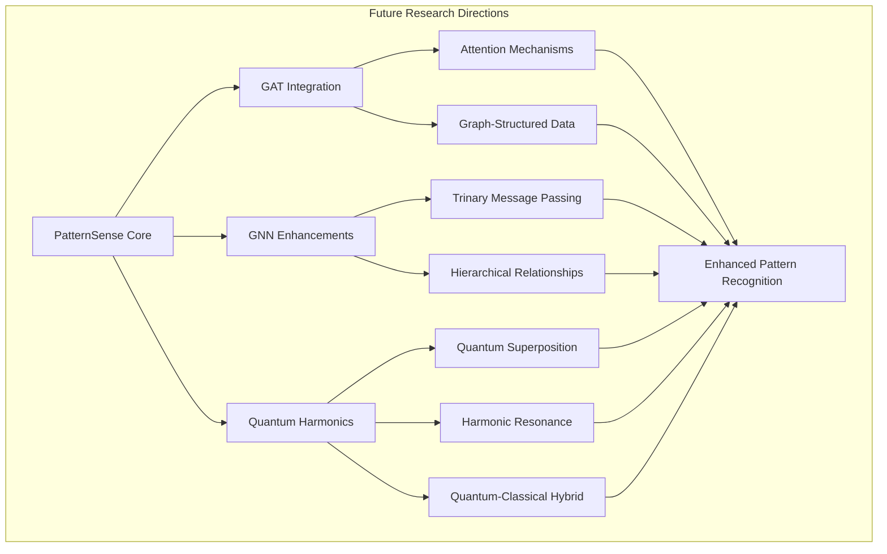

```mermaid
graph TD
    subgraph "Future Research Directions"
        A[PatternSense Core] --> B[GAT Integration]
        A --> C[GNN Enhancements]
        A --> D[Quantum Harmonics]
        
        B --> E[Attention Mechanisms]
        B --> F[Graph-Structured Data]
        
        C --> G[Trinary Message Passing]
        C --> H[Hierarchical Relationships]
        
        D --> I[Quantum Superposition]
        D --> J[Harmonic Resonance]
        D --> K[Quantum-Classical Hybrid]
        
        E --> L[Enhanced Pattern Recognition]
        F --> L
        G --> L
        H --> L
        I --> L
        J --> L
        K --> L
    end
```
