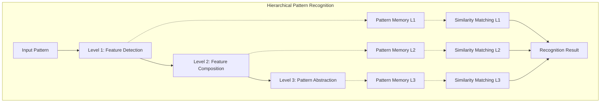

```mermaid
graph TD
    subgraph "Hierarchical Pattern Recognition"
        A[Input Pattern] --> B[Level 1: Feature Detection]
        B --> C[Level 2: Feature Composition]
        C --> D[Level 3: Pattern Abstraction]
        
        B -.-> E[Pattern Memory L1]
        C -.-> F[Pattern Memory L2]
        D -.-> G[Pattern Memory L3]
        
        E -.-> H[Similarity Matching L1]
        F -.-> I[Similarity Matching L2]
        G -.-> J[Similarity Matching L3]
        
        H --> K[Recognition Result]
        I --> K
        J --> K
    end
```
