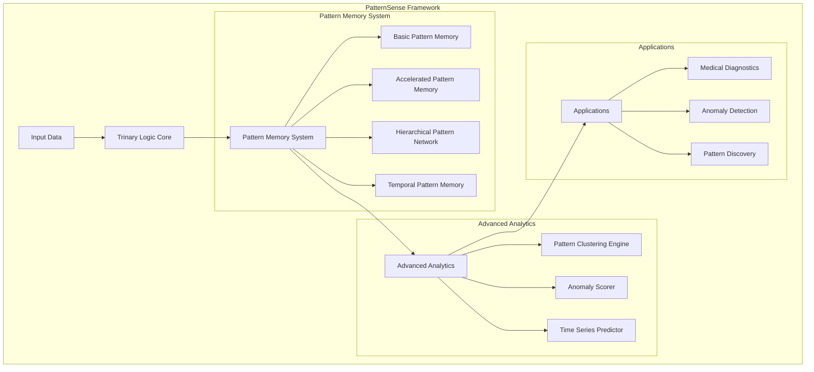

```mermaid
graph TD
    subgraph "PatternSense Framework"
        A[Input Data] --> B[Trinary Logic Core]
        B --> C[Pattern Memory System]
        
        subgraph "Pattern Memory System"
            C --> D[Basic Pattern Memory]
            C --> E[Accelerated Pattern Memory]
            C --> F[Hierarchical Pattern Network]
            C --> G[Temporal Pattern Memory]
        end
        
        C --> H[Advanced Analytics]
        
        subgraph "Advanced Analytics"
            H --> I[Pattern Clustering Engine]
            H --> J[Anomaly Scorer]
            H --> K[Time Series Predictor]
        end
        
        H --> L[Applications]
        
        subgraph "Applications"
            L --> M[Medical Diagnostics]
            L --> N[Anomaly Detection]
            L --> O[Pattern Discovery]
        end
    end
```
