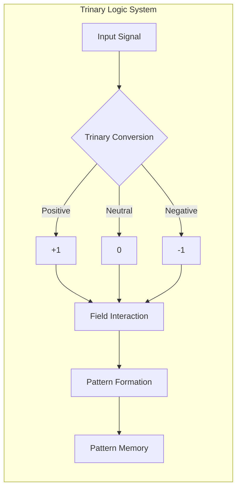

```mermaid
graph LR
    subgraph "Trinary Logic System"
        A[Input Signal] --> B{Trinary Conversion}
        B -->|Positive| C[+1]
        B -->|Neutral| D[0]
        B -->|Negative| E[-1]
        
        C --> F[Field Interaction]
        D --> F
        E --> F
        
        F --> G[Pattern Formation]
        G --> H[Pattern Memory]
    end
```
